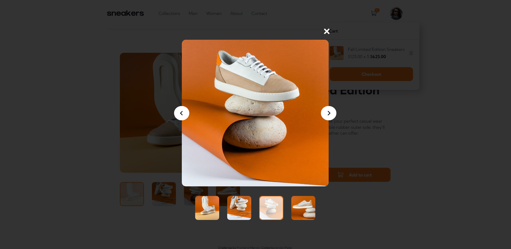

# Frontend Mentor - E-commerce product page solution

## Overview

### The challenge

Ecommerce Product Page
- Image slider w/ thumbnails for desktop, prev and next buttons for mobile. 
- Lightbox gallery (modal image slider). 
- Choose quantity of items and add them to cart. 
- View Cart, remove items from cart. 

### Links

- Live Site URL: [https://jordansgit.github.io/e-commerce-product-page/](https://jordansgit.github.io/e-commerce-product-page/)

## My process

### Built with

- HTML
- CSS 
- SCSS 
- JavaScript 

### What I learned

- SCSS: nesting code with scss, creating mixins for reusable code, using partials to structure layout. 
- JS: how to get a slideshow and a modal slideshow to work without repeating js code. 
